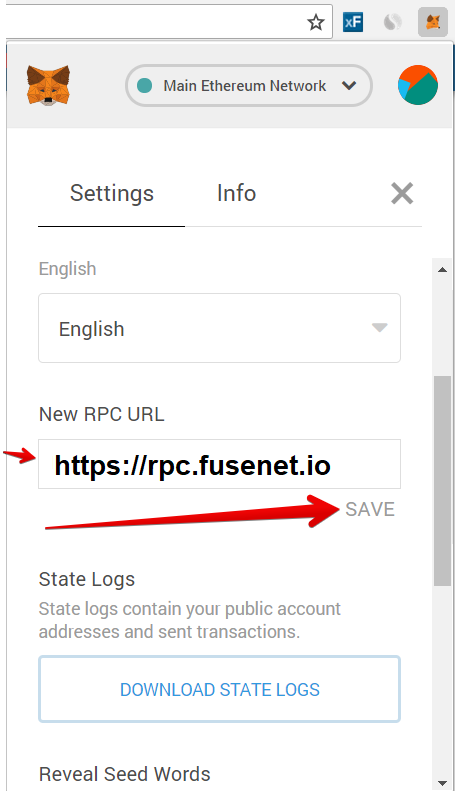

# How to add Ctex to your Metamask

1. To set up Ctex as a new network on Metamask. Click on the network selector at the top of the app and then choose "Custom RPC" from the list:     
2. Then in the "New RPC URL" enter this address: New rpc URL: **`https://mainnet-rpc.ctexscan.com`**


Optionally you can add the full parameters:

**Additional**: [https://mainnet-rpc.ctexscan.com](https://mainnet-rpc.ctexscan.com)  
**ChainId**: 0x7a  
**Explorer**: [https://ctexscan.com](https://ctexscan.com/)  
**Symbol**: Ctex


  


**Note: Please make sure you send Ctex assets to only other fuse chain wallets and not any exchanges. We won't be able to retrieve the funds in case fuse assets are sent to non Ctex chain supported wallets/exchanges.**


  

